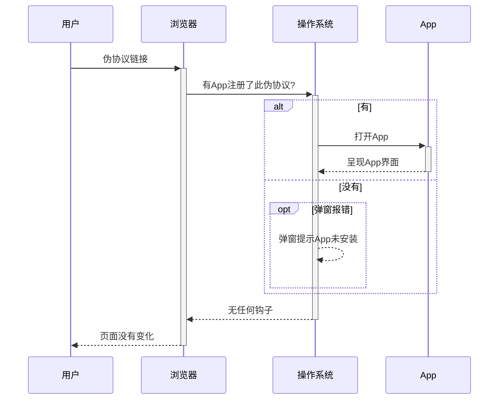
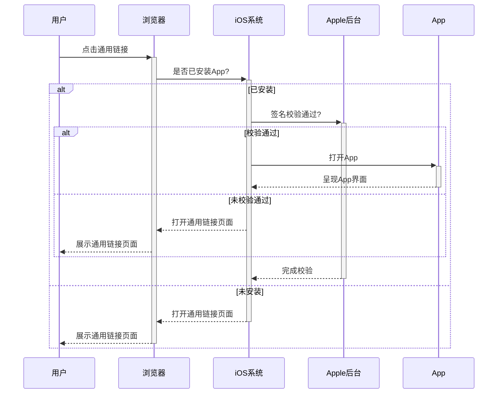
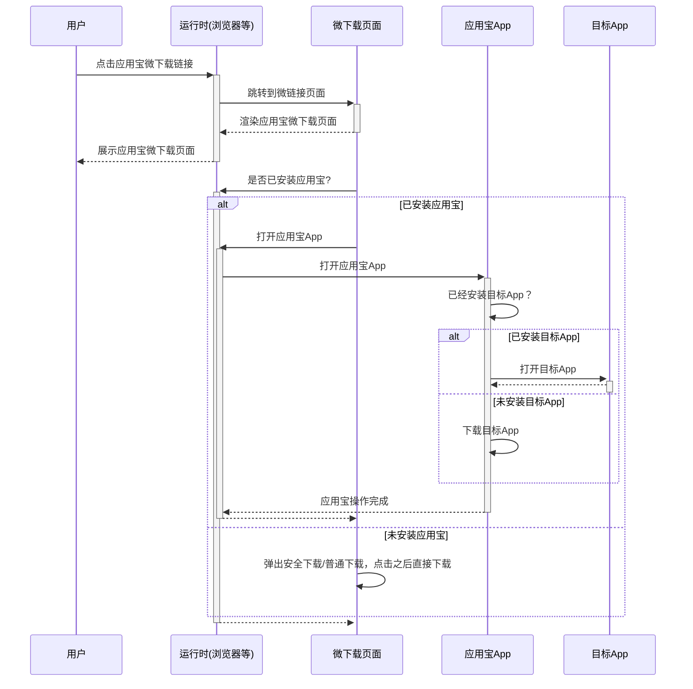
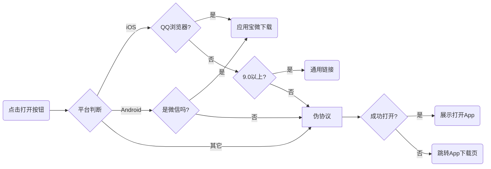

作为一个移动前端开发人员一定会遇到这样的需求：在QQ、微信和普通浏览器等App中单击一个按钮打开“自家App”中的指定页面。

## 1、如何打开App

打开App的方式主要有：

**1. 伪协议：** 这种方式需要App先注册伪协议，然后在浏览器等应用中加载伪协议链接便可以打开。这种方式几乎所有操作系统都支持。

**2. 通用链接：** 这是`iOS 9.0`之后才推出的一种方式，它和伪协议很像，但更友好安全，可操作性也更强。

**3. 包名：** 这是Android提供的方式，通过包名检测手机是否安装某App，并且可以打开指定包名的App，但是仅限于Android本地应用使用。

**4. shell命令：** 这种方式每只程序猿应该都了解不再赘述。

本文主要介绍如何利用这些已有的方案完成从手机端网页打开App。

### 1.1 伪协议

每一个本地应用(App)都可以向操作系统申请注册一个**独一无二**的伪协议，当有人尝试**加载**该**伪协议链接**时操作系统就会打开注册了该伪协议的本地应用。

你可以[**点击该链接**](weixin://)打开微信，这就是利用**伪协议**来打开App的例子。

伪协议工作的时序图大致如下：



这个方案看起来简单直接，但却存在着许多**兼容性问题**，后文会详细介绍如何解决这些问题。

### 1.2 通用链接(仅iOS9)

上面的方案在`iOS 9.0`之前表现很好，但是`iOS 9.0`以后则会弹出一个确认弹窗，这对于美丽大方追求完美的产品小姐姐来说是不可能接受的。

好在`iOS 9.0`之后的版本苹果给出了更优的解决方案——**通用链接**。

如何使用通用链接请参考[iOS 9.0通用链接（universal link）](http://fegirl.com/2016/06/27/IOS9%20%E9%80%9A%E7%94%A8%E9%93%BE%E6%8E%A5%EF%BC%88universal%20link%EF%BC%89/)本文就不赘述了。

实际上**通用链接**就是一个普通的**https**链接，其工作时序图大致如下：



上面的时序图中的**浏览器**不包含**QQ浏览器**，应该是腾讯做了限制。

### 1.3 应用宝微下载

上面两种方案组合起来在绝大多数情况下都能正常工作，但在微信中这两种方式都无法打开App，我们只能尝试通过中间页引导用户使用外部浏览器打开。然而在Android系统上的微信中，通过引导页引导用户从浏览器打开App的兼容性问题也很多。

虽然微信**屏蔽**了`通用链接`和`伪协议`，好在有**应用宝微下载**可以作为一个可选方案来处理此问题。

在实际生活中，我们常常将链接分享到微信群或朋友圈，好友点击链接都是从微信中打开的，因此兼容微信是刚性需求。

应用宝微下载需要注册腾讯应用宝账号，并按照腾讯的文档指引进行配置集成。此处不赘述如何集成，后文会给出关键代码。

通过应用宝微下载打开App的时序图简化如下:



应用宝微下载页面的业务逻辑相当复杂，同样存在很多兼容性问题，它仅仅兼容他们自家的浏览器和App(**QQ浏览器、QQ和微信**)，其它的浏览器**都不兼容**。


_应用宝微下载的广泛使用要多亏微信和QQ浏览器，它们全方位封堵了伪协议和通用链接方案，还为应用宝提供了**专用**接口。_
大写的**<span style="font-size: 1.5em">服气!!!</span>**


通过应用宝打开App的体验**非常鸡肋**(打开App之前首先需要打开应用宝App或链接页面)，因此某些情形下我们依旧不会使用应用宝的方案。

## 2. 解决方案

程序开发工作中前端和后台最大的区别在于前端需要兼容各种奇葩的运行时环境，而后台只需要保证程序能在服务器上正常工作即可。

一个完善的前端解决方案必须兼容**主流的运行时**环境。

### 2.1 分析现状

我们将上面三种方案的的兼容性进行整理如下表：

| 方案          | 微信  |  QQ   | UC 浏览器 | QQ 浏览器 | QQ 浏览器(iOS) | Chrome | Safari |
| :------------ | :---: | :---: | :-------: | :-------: | :------------: | :----: | :----: |
| 伪协议        |  _N_  | **Y** |   **Y**   |   **Y**   |      _N_       | **Y**  | **Y**  |
| 通用链接(iOS) |  _N_  | **Y** |   **Y**   |    N/A    |      _N_       | **Y**  | **Y**  |
| 应用宝微下载  | **Y** | **Y** |    _N_    |   **Y**   |     **Y**      |  _N_   |  _N_   |

### 2.2 梳理流程

根据上表的列出的情况以及综合上述三种方案将流程图绘制出来，流程图如下：



可以看出，流程图中有`未能打开App`的情况，这种情况通常是因为用户还未安装我们的App，这时我们要引导用户下载并安装App。

### 2.3 编写代码

接下来的工作就只需照着流程图编写代码即可，核心代码包含如下两个文件:

> `app-launcher.js`

```js
import { runtime } from './runtime.js';

class AppLauncher {
  constructor(config = {
    // App在苹果应用商店发布的地址
    appStoreLink: '',
    // App在应用宝推广的链接
    appBabyLink: '',
    // 直接打开App使用的协议
    schema: '',
    // iOS 9以上，使用通用链接
    universalLink: ''
  }) {
    this.config = config;
  }
  /**
   * 打开App
   **/
  launch() {
    if(runtime.isIOS) {
      // iOS

      if(runtime.isQQBrowser) {

        // iOS上的QQ浏览器，只有通过应用宝打开
        this.goToAppBaby();
      } else if(getIOSVersion() >= 9) {

        // iOS9.0以上版本，使用通用链接是最佳选择
        this.loadUniversalLink();
      } else {

        // 其它版本使用伪协议打开
        this.enterAppUseSchema();
      }
    } else if(runtime.isAndroid) {
      // Android

      if(runtime.isWechat) {

        // Android上微信使用应用宝打开，微信给应用宝开了私有接口
        this.goToAppBaby();
      } else {

        // Android上的其它情况使用伪协议打开
        this.enterAppUseSchema();
      }
    } else {
      // 探针无法正确检测的其它设备使用伪协议尝试打开
      this.enterAppUseSchema();
    }
  }
  /**
   * 打开通用链接
   */
  loadUniversalLink() {
    location.href = this.config.universalLink;
  }
  /**
   * 打开应用宝
   */
  goToAppBaby() {
    location.href = this.config.appBabyLink;
  }
  /**
   * 打开AppStore
   */
  openAppStore() {
    location.href = this.config.appStoreLink;
  }
  /**
   * 通过加载schema伪协议唤起进入
   */
  enterAppUseSchema() {
    const config = this.config;
    // 使用scheme唤起
    this.tryCallApp(config.schema);

    this.checkAppIsOpen(succeed => {
      if(succeed) {
        // 如果成功打开，则不继续跳转
        return ;
      }

      // 打开失败之后
      if(runtime.isIOS) {
        // iOS跳转App Store
        this.go(config.appStore);
      } else {
        // 其它设备跳转应用宝
        this.go(config.appBabyLink);
      }
    });
  }
  /**
   * 加载协议链接
   * @param {String} scheme 要加载的scheme
   */
  loadSchema(schema = '') {
    // 动态创建协议链接
    const aLink = document.createElement('a');
    aLink.href = scheme;
    document.body.appendChild(aLink);
    // 组织动态创建标签的事件冒泡以避免上层有事件委托影响页面业务逻辑
    aLink.addEventListener('click', function(e) {
      e.stopPropagation();
      document.body.removeChild(aLink);
    });
    // 触发点击加载链接,与location.href加载类似,此方式兼容性更好
    aLink.click();
  }
}

/**
 * 获取iOS版本号
 * @returns {Number} iOS版本号
 */
function getIOSVersion() {
  const ver = navigator.appVersion.match(/OS (\d+)_(\d+)_?(\d+)?/);
  const version = parseInt(ver[1], 10);
  return version
}

export AppLauncher;
```

> `runtime.js`

```js
// 获取当前运行时的用户代理标识
const userAgent = navigator.userAgent;

// 初始化运行时检查探针
const runtime = {
  // iOS系统
  isIOS: !!userAgent.match(/iPhone|iPad|iPod/i),
  // Android系统
  isAndroid: !!userAgent.match(/Android/i),
  // 微信
  isWechat: !!UA.match(/MicroMessenger/i),
  // QQ浏览器
  isQQBrowser: /MQQBrowser/i.test(userAgent)
};

// 将运行时检查结果导出
export runtime;
```

> 使用代码如下：

```js
import { AppLauncher } from './app-launcher.js';


new AppLauncher({
  // App在苹果应用商店发布的地址
    appStoreLink: '...',
    // App在应用宝推广的链接
    appBabyLink: '...',
    // 直接打开App使用的协议
    schema: '...',
    // iOS 9以上，使用通用链接
    universalLink: '...'
}).launch();

```

## 3. 文末吐槽

由于前端程序的运行时环境来自不同厂商和团队，他们的设计理念不同，技术水平也稍有差异，这将使前端运行时环境产生差异导致兼容性问题。

兼容性问题是前端程序猿无法逃脱的魔咒，因此作文记录，以备后查。

<!-- 比如某信故意将原本操作系统支持的某些功能屏蔽掉，然后自己开发一个某用宝来支持类似功能。   -->
若有谬误之处，恳请不吝指正。
