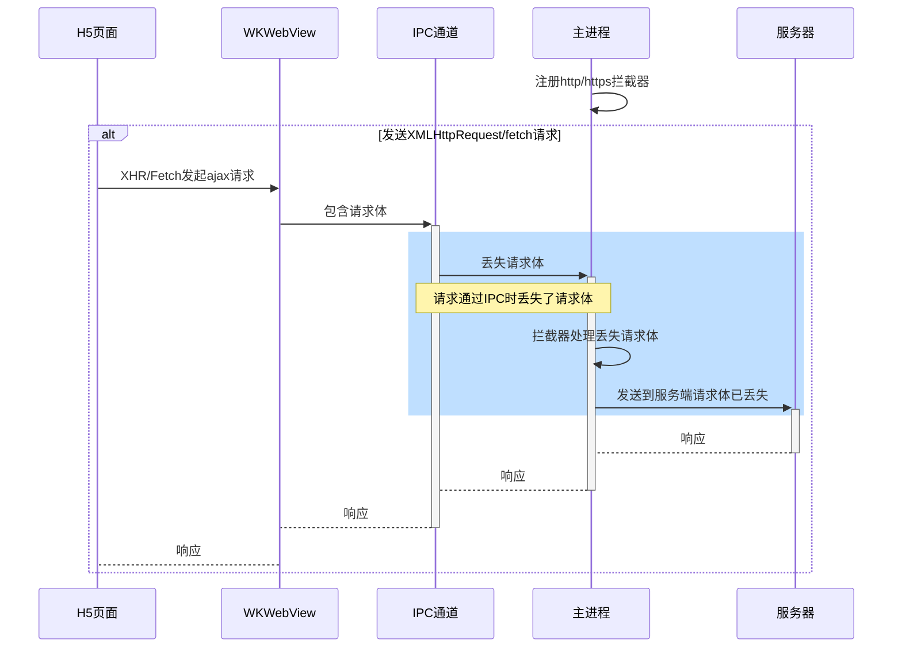

## 一、问题背景

`TIFA`框架升级改造过程中，由于`iOS`上**离线更新方案**调整，`iOS`通过`NSURLProtocol`注册`http和https`协议，企图拦截来自`WKWebView`中的`html/css/js/image`等静态资源，通过本地离线加载(若存在对应资源)。

但是，在此应用场景下，`WKWebView`中加载的`h5`页面通过`fetch`和`XMLHttpRequest`发送的请求`POST/PUT/PATCH`请求都会丢掉请求体。

该问题由来已久，网上也有一些解决方案，但是那些方案要么对上层代码的侵入性比较强，要么在处理文件上传等方面难以完全兼容
`XMLHttpRequest/fetch`规范。

网上其它方案详见：[关于WKWebView的post请求丢失body问题的解决方案
](https://www.jianshu.com/p/4dfc80ca7db2)

## 二、问题分析

造成该问题的主要原因是`WKWebView`运行在一个独立的进程中，而**App请求拦截器运行在应用主进程**，如果在主进程注册了`http`或`https`协议后，独立进程中的`WKWebView`发送的`ajax`请求会通过`IPC`跨进程通信将请求消息发送到主进程，主进程再转发给请求拦截程序。

而在`IPC通信`时，为了性能考虑，苹果底层主动丢掉了请求体，**并且即使此时放弃拦截，请求体也会丢失**。



## 三、解决方案

由于网上的解决方案都不甚令人满意，因为那些解决方案要么需要改变`H5`上层业务发送`ajax`请求的方式，要么无法解决任意类型`ajax`请求体(例如:`FormData`，二进制流)的问题。

根据我们的应用场景，想到其实我们只需要拦截`get请求`，而`get请求`本身就没有请求体，那么能否在通过`AJAX`发送请求时，如果是`POST/PUT/PATCH`并且存在请求体的情况下，就停止拦截请求(`unregister`对应的`protocol`)，因此我们通过`native`暴露了两个方法给JS桥层核心，分别用于**开始和停止http/https请求拦截操作**。

然后在`JS`中代理系统方法`XMLHttpRequest`的`open`和`send`方法，以及`fetch`方法，当请求发起的时候就停止拦截，当请求结束就开启拦截。当然，在停止拦截期间可能存在`get请求`，本应拦截但是由于拦截器处于停止状态，未被拦截到，但是无关紧要，因为在线资源也是可用的，而且这种场景在我们上层业务中很少见。

根据这个思路，我们初步实现了一下，验证是可以的，但是却存在概率性失败的情况，特别是针对`https请求`。

后来经过一整天的尝试和排查，发现存在三个问题：

1. 由于之前我们的桥层无论异步还是同步都使用`prompt`实现，而`prompt`方法会卡`UI主线程`，性能会略低，特别在并发调用时该问题就会凸显出来。因此我们增加了`webkit桥层`来弥补该不足。

2. 由于`native`在开启和停止拦截器的时候，可能由于`native`当前资源消耗太大被阻塞，而导致`js`执行时实际上还未停止拦截器，因此将停止和开启的方法都改成了异步方法。

3. 即使改成了异步，当请求的并发大于`100`时，`https请求`任然会概率性失败(`猜测https请求建立需要大量CPU资源导致，但尚不确定`)，但是如果并发稳定在`100`以内，则相对稳定，经过反复测试不会出现问题。因此我们添加了阻塞队列进行控制，将最大实际并发控制在`50`以内（因为本身浏览器单域并发数也限制在`6`），经过大量测试确定`AJAX`发送`body`的问题得到了解决，且非常稳定。

## 四、源代码：

> **ios-blocking-queue.ts**

```ts
// 阻塞队列，用于控制最大并发
import { execAsync } from '../core';
import config from '../config';

function getSignature(methodName: string): string {
  return `${config.componentPrefix}.${methodName}`;
}

/** 停止拦截请求 */
function stopInterceptRequest(): Promise<void> {
  return execAsync(getSignature('stopInterceptRequest'));
}

/** 开始拦截请求 */
function startInterceptRequest(): Promise<void> {
  return execAsync(getSignature('startInterceptRequest'));
}

/** 阻塞的请求 */
export interface TIFAFetchRequest {
  /** 发送请求的类型 */
  type: TIFARequestType.Fetch;
  /** 调用函数时的参数 */
  args: [RequestInfo, RequestInit|undefined];
  /** fetch方法执行完成后反馈结果的通道 */
  resolve: (response?: Response | PromiseLike<Response> | undefined) => void;
  /** fetch方法执行时产生错误的时候的通知通道 */
  reject: (error: any) => void;
  /** 原生的fetch方法 */
  nativeFetch: (input: RequestInfo, init?: RequestInit) => Promise<Response>;
}


export interface TIFAXhrRequest {
  /** 发送请求的类型 */
  type: TIFARequestType.Xhr;
  /** 如果是xhr请求，则保存该实例 */
  xhr: XMLHttpRequest;
  /** xhr请求的请求体 */
  body: string | Document | Blob | ArrayBufferView | ArrayBuffer |
  FormData | URLSearchParams | ReadableStream<Uint8Array> | null | undefined;
  /** 原生的xhr send方法 */
  nativeSend: (body?: string | Document | Blob | ArrayBufferView | ArrayBuffer |
    FormData | URLSearchParams | ReadableStream<Uint8Array> | null | undefined) => void;
}

export enum TIFARequestType {
  Fetch = 1,
  Xhr = 2,
}

let instance: IOSRequestBlockingQueue;

/** 阻塞队列 */
export class IOSRequestBlockingQueue {
  /** 阻塞队列 */
  private blockingQueue: (TIFAFetchRequest | TIFAXhrRequest)[] = [];

  // 用于计数正在运行的队列任务
  private runningCount = 0;

  // 最大并发数
  private maxConcurrent = 50;

  // 用于计数已发起，但未结束的请求
  private requesting = 0;

  private constructor(maxConcurrent = 50) {
    this.maxConcurrent = maxConcurrent;
  }

  static getInstance(maxConcurrent = 50): IOSRequestBlockingQueue {
    if (!instance) {
      instance = new IOSRequestBlockingQueue(maxConcurrent);
    }
    return instance;
  }

  /**
   * 向队列中添加一个元素
   * @param element 要添加的元素
   */
  add(element: TIFAFetchRequest | TIFAXhrRequest): void {
    const { blockingQueue } = this;
    blockingQueue.push(element);
    if (this.runningCount < this.maxConcurrent) {
      this.runTasks();
    }
  }

  runTasks(): void {
    const { blockingQueue } = this;

    if (blockingQueue.length === 0) return;

    while (this.runningCount < this.maxConcurrent) {
      const request = blockingQueue.shift();
      if (!request) break;

      this.runningCount += 1;
      if (request?.type === TIFARequestType.Fetch) {
        this.doFetch(request);
      } else if (request?.type === TIFARequestType.Xhr) {
        this.doXhr(request);
      }
    }
  }

  /** 执行fetch请求 */
  private async doFetch(request: TIFAFetchRequest): Promise<void> {
    const {
      nativeFetch, resolve, reject, args,
    } = request;

    this.requesting += 1;
    await stopInterceptRequest();

    nativeFetch(...args)
      .then(resolve)
      .catch(reject)
      .finally(async () => {
        this.requesting -= 1;
        this.runningCount -= 1;

        // 继续执行任务
        this.runTasks();

        if (this.requesting === 0) {
          await startInterceptRequest();
        }
      });
  }

  /** 执行xhr请求 */
  private doXhr(request: TIFAXhrRequest): void {
    console.log('doXhr...');
    const { xhr, body, nativeSend } = request;
    let currentRequestFinished = false;
    const onRequestEnd = async (): Promise<void> => {
      if (currentRequestFinished) return;
      currentRequestFinished = true;
      this.requesting -= 1;
      this.runningCount -= 1;
      // 继续执行任务
      this.runTasks();
      if (this.requesting === 0) {
        await startInterceptRequest();
      }
    };

    this.requesting += 1;
    // 需要body，停止拦截
    stopInterceptRequest().then(() => {
      xhr.addEventListener('error', onRequestEnd);
      xhr.addEventListener('load', onRequestEnd);
      xhr.addEventListener('abort', onRequestEnd);
      xhr.addEventListener('timeout', onRequestEnd);
      // 原生发送请求
      nativeSend.call(xhr, body);
    });
  }
}
```
> **ios-post-body-resolver.ts:**
```ts
/**
 * iOS WKWebView POST请求请求体丢失解决方案
 */
import { Runtime } from '../types';
import {
  IOSRequestBlockingQueue, TIFARequestType,
} from './ios-blocking-queue';

const nativeSend = XMLHttpRequest.prototype.send;
const nativeOpen = XMLHttpRequest.prototype.open;

const nativeFetch = window.fetch;

const processMethods = ['POST', 'PUT', 'PATCH'];

async function fetch(input: RequestInfo, init?: RequestInit): Promise<Response> {
  const method = init?.method?.toUpperCase() || '';
  if (processMethods.includes(method) && init?.body !== null && init?.body !== undefined) {
    // 可以附带body的请求，并且请求体不为空，则需要处理
    return new Promise((resolve, reject) => {
      IOSRequestBlockingQueue.getInstance().add({
        type: TIFARequestType.Fetch,
        args: [input, init],
        resolve,
        reject,
        nativeFetch,
      });
    });
  }
  return nativeFetch(input, init).then();
}

let installed = false;

export default function initResolver(runtime: Runtime): void {
  // 已经初始化过了，则不重复初始化
  if (installed) {
    return;
  }
  installed = true;
  if (runtime.isTIFAWebView && runtime.isIOS) {
    window.XMLHttpRequest.prototype.open = function open(method: string, url: string,
      async?: boolean, username?: string, password?: string): void {
      if (processMethods.includes(method.toUpperCase())) {
        this.method = method.toUpperCase();
        nativeOpen.call(this, method, url, async || true, username, password);
      }
    };

    // XHR请求代理
    window.XMLHttpRequest.prototype.send = function send(body?: string | Document | Blob
      | ArrayBufferView | ArrayBuffer | FormData
      | URLSearchParams | ReadableStream<Uint8Array> | null | undefined): void {
      if ((body !== undefined && body !== null) && processMethods.includes(this.method)) {
        // 可以附带body的请求，且请求体不为空，需要处理
        IOSRequestBlockingQueue.getInstance().add({
          type: TIFARequestType.Xhr,
          xhr: this,
          body,
          nativeSend,
        });
      } else {
        // 无需拦截
        nativeSend.call(this, body);
      }
    };

    if (typeof nativeFetch === 'function') {
      window.fetch = fetch;
    }
  }
}

```