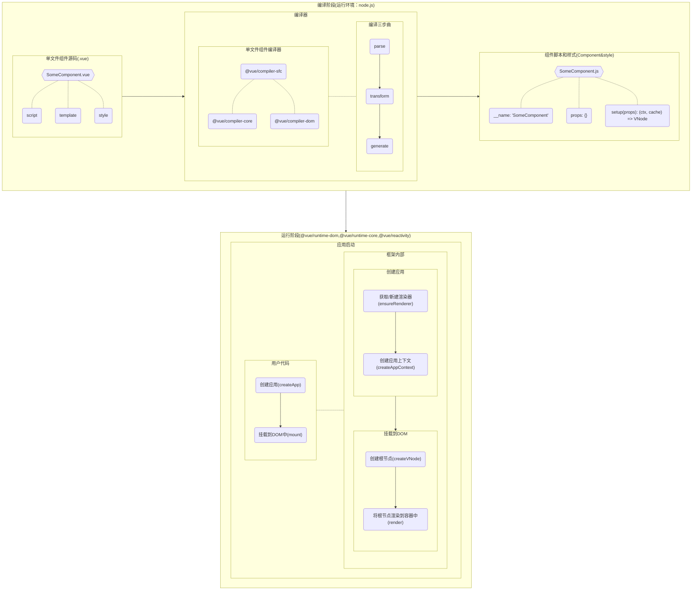
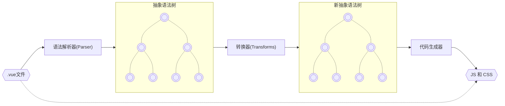

时至今日，Vue3早已被广泛应用到各类线上业务项目。她能优雅地为我们解决数据流转、UI渲染和用户交互等前端数据层和视图层的问题。

虽然，我们对Vue的使用已经非常熟练，并且也能使用她解决日常工作中的各种问题，但是我们可能从未看清她的全貌。

那么，今天我们就尝试站在远处，从宏观的角度来看看她的全貌。

> 提示： 为了抓住故事主线，我们忽略了很多细节。

## 一、整体流程

首先，我们先抛开SSR这种的情况，就从`.vue`单文件组件，最终渲染成浏览器中的`dom`节点的整个过程进行一个宏观的分析。

大致流程应该是如下图所示的这样：



根据上图，我们基于vue单文件组件的工作流程大致描述分为如下两大步：
1. **编译:** 编译阶段是在nodejs环境中执行的，vue单文件组件代码被输入到编译器中，经过三个步骤：**①语法分析(parse)得到抽象语法书AST；②修改抽象语法树(transform)；③重新生成代码(generate)**，最终输出两部分内容——脚本和样式，大体流程如下图:



2. **运行:** 运行阶段发生在浏览器上，我们通过执行`createApp(SomeComponent).mount('#app')`来将我们的组件渲染到id为`app`的DOM节点中。

## 二、源码分析

下面我们从用户侧代码入手，精简掉部分代码后，试着捋出应用启动的主流程相关代码：

### （一）用户侧代码
```ts
import { createApp } from 'vue'
import './style.css'
import SomeComponent from './SomeComponent.vue'

createApp(SomeComponent).mount('#app');
```

我们通过`createApp(SomeComponent).mount('#app');`这行代码创建应用，并将根节点生成的dom对象挂载到`id`为`app`的节点上。

接下来，我们继续深入框架，看看上面的代码实际做了什么！

### （二） 创建应用的入口函数

```ts
export const createApp = ((...args) => {
  // 通过ensureRenderer函数获得渲染器
  const app = ensureRenderer().createApp(...args)

  const { mount } = app
  app.mount = (containerOrSelector: Element | ShadowRoot | string): any => {
    ...
  }

  return app
}) as CreateAppFunction<Element>
```

`createApp()`函数会通过渲染器创建一个应用（[查看源码](https://github.com/vuejs/core/blob/f66a75ea75c8aece065b61e2126b4c5b2338aa6e/packages/runtime-dom/src/index.ts#L67)），而`ensureRenderer()`会获得渲染器，创建应用之后，代码中还重写了`app.mount`函数，这里我们先跳过。

接下来，我们先看看渲染器是怎么获取的！

### （三） 获取渲染器

`ensureRenderer()`函数首先判断闭包内是否存在`renderer`，如果存在则直接返回，不存在则新建`renderer`。这个`renderer实例`就是渲染器。[查看源码](https://github.com/vuejs/core/blob/f66a75ea75c8aece065b61e2126b4c5b2338aa6e/packages/runtime-dom/src/index.ts#L43)

```ts
let renderer: Renderer<Element | ShadowRoot> | HydrationRenderer

function ensureRenderer() {
  return (
    renderer ||
    (renderer = createRenderer<Node, Element | ShadowRoot>(rendererOptions))
  )
}
```

如果点击源码链接，在下方还会看到`createSSRApp`函数，它会调用`ensureHydrationRenderer`返回一个渲染器。

这里，vue对渲染器进行了抽象，渲染器被抽象成了接口([查看源码](https://github.com/vuejs/core/blob/f66a75ea75c8aece065b61e2126b4c5b2338aa6e/packages/runtime-core/src/renderer.ts#L77C18-L77C26))，下面摘抄了相关源码：
```ts
export interface Renderer<HostElement = RendererElement> {
  render: RootRenderFunction<HostElement>
  createApp: CreateAppFunction<HostElement>
}

export interface HydrationRenderer extends Renderer<Element | ShadowRoot> {
  hydrate: RootHydrateFunction
}
```
那么，这么做有什么好处呢？ 这样做，**可以将渲染器与具体实现进行分离**，渲染器只需要包含`render`和`createApp`两个方法，而对于`HydrationRenderer`接口，也就需要多实现一个`hydrate`方法。

对于 **“可以将渲染器与具体实现进行分离”** 我想再细致地说一下：
1. `Renderer`接口很抽象地描述了，对于一个渲染器，首先，要提供一个`createApp`方法来创建一个应用，
其次，需要提供一个render方法来执行渲染。

2. 至于具体如何创建应用如何渲染，并没有做细节规定，只要根据接口声明的方法签名进行实现即可。

3. 这样一来，我们在dom运行环境的渲染器和SSR环境的渲染器就可以各自按照自己的需要实现即可。

**拓展一下:** 这样设计的好处就是，假设我们要基于vue3实现类似`ReactNative`那样的将vue3的组件渲染成`NativeUI`应该怎么做呢？没错，为它实现一个新的渲染器即可，实现之后前端应用入口代码大概会改成这样：
```ts
import { createNativeApp } from 'vue'
import './style.css'
import SomeComponent from './SomeComponent.vue'

createNativeApp(SomeComponent).mount('appContainer');
```

扯远了，我们继续回来看渲染器究竟是怎么被创建出来的呢？

### （四） 创建渲染器
渲染器最终是通过`baseCreateRenderer`函数来实现的([查看源码](https://github.com/vuejs/core/blob/f66a75ea75c8aece065b61e2126b4c5b2338aa6e/packages/runtime-core/src/renderer.ts#L328))，这个函数特别长，函数体就有600多行，那么这个函数究竟做了什么呢？

为了方便分析，我们将无关代码都先省略掉：

```ts
function baseCreateRenderer(
  options: RendererOptions,
  createHydrationFns?: typeof createHydrationFunctions,
): any {
  ... // 这里省略了几百行代码
  return {
    render,
    hydrate,
    createApp: createAppAPI(render, hydrate),
  }
}
```

虽然`baseCreateRenderer`函数很长，但是我们可以看到，最后只是返回了一个符合渲染器接口的对象，而这个对象就是最终的渲染器实例。

除了返回值，我们再看它的第一个入参`options`，其类型是`RendererOptions`，下面是其类型信息：

```ts
export interface RendererOptions<
  HostNode = RendererNode,
  HostElement = RendererElement,
> {
  patchProp(
    el: HostElement,
    key: string,
    prevValue: any,
    nextValue: any,
    namespace?: ElementNamespace,
    prevChildren?: VNode<HostNode, HostElement>[],
    parentComponent?: ComponentInternalInstance | null,
    parentSuspense?: SuspenseBoundary | null,
    unmountChildren?: UnmountChildrenFn,
  ): void
  insert(el: HostNode, parent: HostElement, anchor?: HostNode | null): void
  remove(el: HostNode): void
  createElement(
    type: string,
    namespace?: ElementNamespace,
    isCustomizedBuiltIn?: string,
    vnodeProps?: (VNodeProps & { [key: string]: any }) | null,
  ): HostElement
  createText(text: string): HostNode
  createComment(text: string): HostNode
  setText(node: HostNode, text: string): void
  setElementText(node: HostElement, text: string): void
  parentNode(node: HostNode): HostElement | null
  nextSibling(node: HostNode): HostNode | null
  querySelector?(selector: string): HostElement | null
  setScopeId?(el: HostElement, id: string): void
  cloneNode?(node: HostNode): HostNode
  insertStaticContent?(
    content: string,
    parent: HostElement,
    anchor: HostNode | null,
    namespace: ElementNamespace,
    start?: HostNode | null,
    end?: HostNode | null,
  ): [HostNode, HostNode]
}
```

初看起来可能有点不理解，但是仔细看接口中的这些方法签名就能明白**这些函数描述的都是如何处理一个具体的节点**，这些节点其实是抽象的本地节点，并未规定一定是浏览器上的节点，比如`insert`方法，描述的是如何插入一个元素，那么在实现不同平台的渲染器的时候，我们就可以根据不同的平台特性进行实现了。

这样的设计同样是为了让渲染器的设计与实现解耦。

### （五） 创建App

之前我们看到`ensureRenderer().createApp(...args)`代码，而这里的`createApp`函数正是我们上面看到的通过`createAppAPI(render, hydrate)`函数创建出来的。[查看源码](https://github.com/vuejs/core/blob/f66a75ea75c8aece065b61e2126b4c5b2338aa6e/packages/runtime-core/src/apiCreateApp.ts#L201)

为了便于理解，精简后的代码如下：
```ts
export function createAppAPI<HostElement>(
  render: RootRenderFunction<HostElement>,
  hydrate?: RootHydrateFunction,
): CreateAppFunction<HostElement> {
  return function createApp(rootComponent, rootProps = null) {
    ...
    const context = createAppContext()
    const installedPlugins = new WeakSet()

    let isMounted = false

    const app: App = (context.app = {
      _uid: uid++,
      _component: rootComponent as ConcreteComponent,
      _props: rootProps,
      _container: null,
      _context: context,
      _instance: null,

      version,

      use(plugin: Plugin, ...options: any[]) {
        ...
        return app
      },

      mixin(mixin: ComponentOptions) {
        ...
        return app
      },

      component(name: string, component?: Component): any {
        ...
        return app
      },

      directive(name: string, directive?: Directive) {
        ...
        return app
      },

      mount(
        rootContainer: HostElement,
        isHydrate?: boolean,
        namespace?: boolean | ElementNamespace,
      ): any {
        ...
      },

      unmount() {
        ...
      },

      provide(key, value) {
        ...
        return app
      },

      runWithContext(fn) {
        ...
      },
    })

    return app
  }
}
```
从代码中可以看到，创建应用的时候，首先通过`const context = createAppContext()`先创建了一个应用上下文，然后再通过`const app: App = (context.app = {...,_context: context,...});`将应用上下文和我们新建的app对象关联起来，返回给外部，同时，我们还看到上面的很多我们常用的方法的实现，比如：`mount`、`component`、`directive`等。

下面我们贴出这个`createAppContext`函数([查看源码](https://github.com/vuejs/core/blob/f66a75ea75c8aece065b61e2126b4c5b2338aa6e/packages/runtime-core/src/apiCreateApp.ts#L172))的源码，其实很简单，就是创建了一个空的App上下文，这个上下文的主要作用的保存App实例的状态，源码如下：

```ts
export function createAppContext(): AppContext {
  return {
    app: null as any,
    config: {
      isNativeTag: NO,
      performance: false,
      globalProperties: {},
      optionMergeStrategies: {},
      errorHandler: undefined,
      warnHandler: undefined,
      compilerOptions: {},
    },
    mixins: [],
    components: {},
    directives: {},
    provides: Object.create(null),
    optionsCache: new WeakMap(),
    propsCache: new WeakMap(),
    emitsCache: new WeakMap(),
  }
}
```

### （六） 挂载

我们省略掉很多代码之后，挂载方法如下，我们可以看出，`mount`主要做了以下几件事：
1. 根据应用根组件创建应用的VNode根节点
2. 给根节点加上应用上下文
3. 将根节点渲染到`rootContainer`容器中，这个`rootContainer`容器也就是我们应用的挂载点
4. 返回应用的代理

```ts
mount(
  rootContainer: HostElement,
  isHydrate?: boolean,
  namespace?: boolean | ElementNamespace,
): any {
  if (!isMounted) {
    const vnode = createVNode(rootComponent, rootProps)
    // store app context on the root VNode.
    // this will be set on the root instance on initial mount.
    vnode.appContext = context

    if (namespace === true) {
      namespace = 'svg'
    } else if (namespace === false) {
      namespace = undefined
    }

    if (isHydrate && hydrate) {
      hydrate(vnode as VNode<Node, Element>, rootContainer as any)
    } else {
      render(vnode, rootContainer, namespace)
    }
    isMounted = true
    app._container = rootContainer
    // for devtools and telemetry
    ;(rootContainer as any).__vue_app__ = app

    return getExposeProxy(vnode.component!) || vnode.component!.proxy
  }
},
```

首先，值得注意的是，在将节点渲染到容器的时候有一个判断条件，`isHydrate && hydrate`，这个是当我们的页面是通过SSR初始化的时候，这时候，应用已经在服务端渲染过了，因此我们需要将虚拟节点与DOM节点水合，这个水合的过程以及渲染的核心逻辑我们就留着后续再分析吧。


另外，值得注意的是，我们的在[第二步](#二-创建应用的入口函数)处忽略的一行代码`app.mount = (containerOrSelector: Element | ShadowRoot | string): any => {...}`，这里重写了此处返回的mount方法，那么我们来看看之前被我们省略掉的代码：

```ts
 app.mount = (containerOrSelector: Element | ShadowRoot | string): any => {
    const container = normalizeContainer(containerOrSelector)
    if (!container) return

    const component = app._component
    if (!isFunction(component) && !component.render && !component.template) {
      component.template = container.innerHTML
    }

    // clear content before mounting
    container.innerHTML = ''
    const proxy = mount(container, false, resolveRootNamespace(container))
    if (container instanceof Element) {
      container.removeAttribute('v-cloak')
      container.setAttribute('data-v-app', '')
    }
    return proxy
  }
```

可以看到，这里主要是在挂载之前对目标容器做了处理，最后还是调用了`createAppAPI`函数生成的mount函数。

## 三、总结

vue单文件组件经过编译器编译成js和css文件，并通过vue提供的渲染器根据组件新建应用，执行渲染并挂载到dom容器中。

**由于笔者的水平所限，文章可能存在不足和谬误，还请大家不吝指正。**
